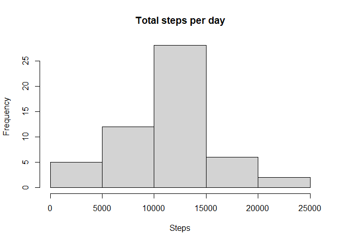
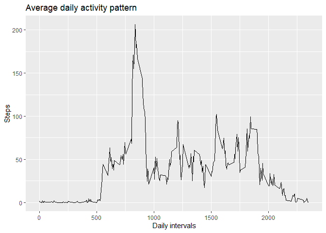
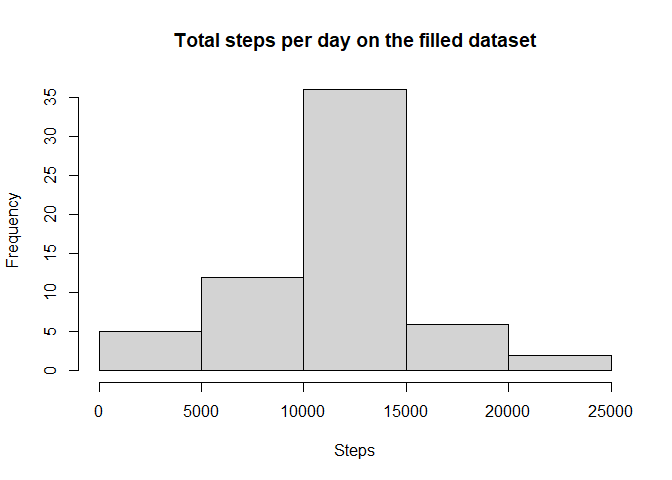
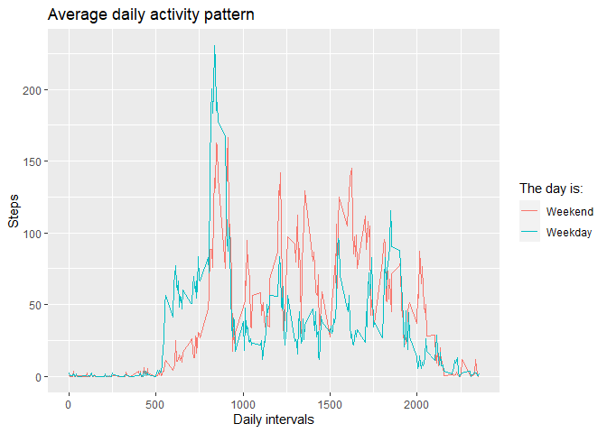

***

Author: Fernando Garcia  
Date: 01/12/2021  
email: fernando.garcia@exatec.tec.mx  

---

## Loading and preprocessing the data

```r
# Importing libraries
library(data.table)
library(dplyr)
library(ggplot2)
library(chron)
```


```r
# Extracting the cvs file
if (!file.exists('./activity.csv')){
  unzip("activity.zip", exdir = getwd())
}
# Read the file and clean it
dataset <- fread("activity.csv", header=T)
data    <- dataset[complete.cases(dataset),]
str(data)
```

```
## Classes 'data.table' and 'data.frame':	15264 obs. of  3 variables:
##  $ steps   : int  0 0 0 0 0 0 0 0 0 0 ...
##  $ date    : IDate, format: "2012-10-02" "2012-10-02" ...
##  $ interval: int  0 5 10 15 20 25 30 35 40 45 ...
##  - attr(*, ".internal.selfref")=<externalptr>
```


## What is mean total number of steps taken per day?

```r
# Calculate the total number of steps taken per day
daily_steps        <- data %>% group_by(date) %>% summarize(sum = sum(steps), .groups = 'drop')
daily_mean_steps   <- mean(daily_steps$sum)
daily_median_steps <- median(daily_steps$sum)
```

The mean total number of steps taken per day is 1.0766189\times 10^{4}.  
The median total number of steps taken per day is 10765.

This is a histogram of the total number of steps taken each day:  


```r
hist(daily_steps$sum, main="Total steps per day", xlab="Steps")
```

<!-- -->

## What is the average daily activity pattern?

The following graph shows the pattern of activity averaged per day:


```r
mean_by_interval <- aggregate(data$steps, by=list(data$interval), FUN = mean)
p <- ggplot(mean_by_interval , aes(x=Group.1, y=x)) + geom_line() 
p <- p + xlab("Daily intervals") + ylab("Steps")
p <- p + labs(title="Average daily activity pattern")
print(p)
```

<!-- -->


```r
max_interval = mean_by_interval[which.max(mean_by_interval$x),1]
max_intervav = mean_by_interval[which.max(mean_by_interval$x),2]
```

The 5-minute interval that contains the maximum number of steps (on average across all the days in the dataset) is 835 with 206.1698113 steps.

## Imputing missing values

```r
# Extracting the missing samples
missing_data <- dataset[!complete.cases(dataset),]
```

In the dataset there are 2304 values with missing data. The missing values will be replaced by the respective number of steps correspond to the mean total pattern previously calculated.


```r
# Replacing the NA steps by the daily pattern mean total steps
for (i in 1:nrow(mean_by_interval)){
  missing_data$steps[missing_data$interval %in% mean_by_interval$Group.1[i]] <- mean_by_interval$x[i]
}

# Making the filled dataset
filled_data <- rbind(data, missing_data)

# Calculate the total number of steps taken per day
daily_steps2 <- filled_data %>% group_by(date) %>% summarize(sum = sum(steps), .groups = 'drop')
```

Once filled the dataset the mean and median of total number of steps taken per day are 1.0766189\times 10^{4} and 1.0766189\times 10^{4} respectively.  

This is a histogram of the total number of steps averaged per day (with the filled dataset):  


```r
# Plotting the histogram
hist(daily_steps2$sum, main="Total steps per day on the filled dataset", xlab="Steps")
```

<!-- -->

#### Do the new mean and median values differ from the estimates from the first part of the assignment?

The next table shows the mean and median values for the database before and after to fill the missing values.

 Database | Mean | Median
----------|------|-------
non filed | 1.0766189\times 10^{4}       |10765
filled    | 1.0766189\times 10^{4} | 1.0766189\times 10^{4}

The mean values are equal and the median values are very close.

## Are there differences in activity patterns between weekdays and weekends?

Yes, there is. The following graph shows that the activity pattern on the two days are different.


```r
# Creating the factor weekday
filled_data$weekday <- factor(!is.weekend(filled_data$date), labels=c("weekend", "weekday"))

# Making the plot to compare the pattern of a weekday and a weekend day
mean_by_interval <- aggregate(filled_data$steps, by = list(filled_data$interval, filled_data$weekday), FUN = mean)
p <- ggplot(mean_by_interval, aes(x=Group.1, y=x, col = Group.2)) + geom_line() 
p <- p + xlab("Daily intervals") + ylab("Steps")
p <- p + labs(title="Average daily activity pattern")
p <- p + scale_colour_discrete(name = "The day is:", labels = c("Weekend", "Weekday"))
print(p)
```

<!-- -->
